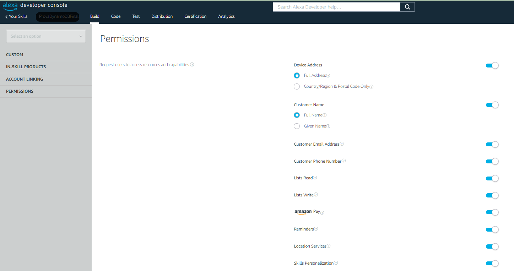

# CoTra (Cognitive Training)
## Project realized by a team of students from Politecnico di Milano.

### Authors: Giulia Carpani, Filippo Castellani, Orith Halfon, Stefano Vannoni, Elisabetta Marini.

## What does it do ?
Our skill implements a digital version of the [Paced Auditory Serial Addition Test][1].

## Scope: 
This skill was created for [Alexa][2] devices, leveraging the powerful framework of [Alexa Skill Kit][3].

## What software does it require ?
 - No software is required to run this. It is sufficient to upload the files on the [Alexa Developer Console][4] (ADC) after creating your own account. You can either, download the files in this repository or alternatively select the github repository link as template, when creating a new skill.
    - **Remember** to add both Italian and English-US languages on the skill settings.
 - A **very important step**: you need to provide the permissions indicated in the paragraph down below for a proper use of the skill with all its functionalities.
 
 ---

## Example scenario:
By cloning this repository and uploading it on the [ADC][4] you will be able to launch the skill by saying:

"_Alexa Launch CoTra Skill_".

- if you decide to refer to this GitHub repo to upload the skill, **please remeber** to change the skill invocations name which is set by default to _"change me"_

---

## Configuration of Permissions
1. Provide permission on the ADC.

2. Install the Alexa App on your phone and log in with the same account you are using on Alexa Developer Console.
3. Provide permissions on your phone.

Select the skill.

Provide permissions.

---

## Lambda Structure:

An in-depth description of the scripts can be found [here][5], side by side with the code but here we introduce the main scripts of our skill.

1. `index.js` : contains all the intent handlers and main dependencies.
2. `logic.js` : contains usefull functions mainly related to the creation of reminders
3. `localisation.js` : contains all the sentences Alexa is supposed to answer in Italian and English
4. `interceptors.js` : specifies the interceptors behaviour during Requests and Responses, from and to Alexa's Front-End. 

--- 

## Special Thanks:
[Rahul Yadav][7] - Voice Evangelist for DabbleLab

[Andrea Muttoni][6] - Former Tech Evangelist for Amazon

[Permissions_on_ADC]:Images/Permissions_on_ADC.png
[Permissions_on_phone]:Images/Permissions_on_phone.jpg
[Permissions_on_phone2]:Images/Permissions_on_phone2.jpg

[1]:https://en.wikipedia.org/wiki/Paced_Auditory_Serial_Addition_Test
[2]:https://developer.amazon.com/en-US/alexa
[3]:https://developer.amazon.com/en-US/alexa/alexa-skills-kit
[4]:https://developer.amazon.com/alexa/console/ask
[5]:https://github.com/stevanna98/CoTra/tree/main/lambda
[6]:https://muttoni.github.io/blog/about/
[7]:https://twitter.com/rahulyadav360